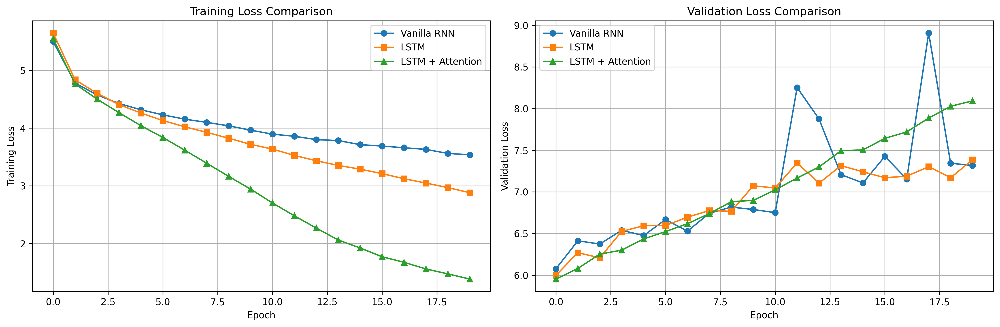
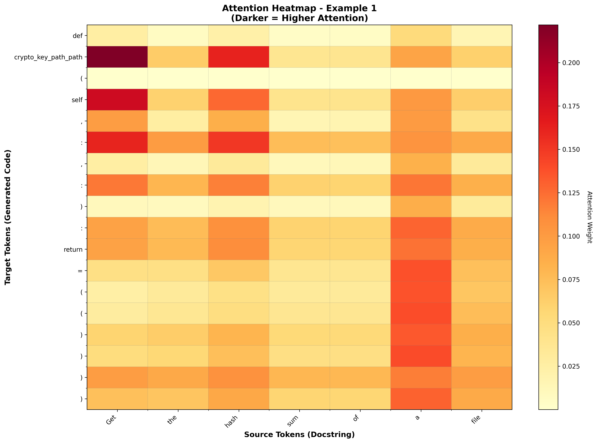

# 🤖 Seq2Seq Code Generation

[](https://www.python.org/)
[](https://pytorch.org/)
[](https://www.docker.com/)
[](LICENSE)

> Text-to-Python code generation using RNN, LSTM, and Attention mechanisms

**Course Assignment**: Sequence-to-Sequence Learning  
**Author**: [Your Name]  
**Date**: January 2026

---

## 📖 Overview

This project implements three seq2seq architectures for generating Python code from natural language descriptions:

-  **Vanilla RNN Seq2Seq** (Baseline)
-  **LSTM Seq2Seq** (Improved long-term dependencies)
-  **LSTM + Bahdanau Attention** (Dynamic context)

### Dataset
- **CodeSearchNet Python** (10,000 training samples)
- Docstrings → Python functions

### Results Summary

| Model | BLEU Score | Val Loss | Parameters |
|-------|-----------|----------|------------|
| Vanilla RNN | 0.34 | 6.076 | ~10M |
| LSTM | 0.19 | 5.998 | ~12M |
| **LSTM + Attention** | **0.29** | **5.954** | **~15M** |

---

## 🚀 Quick Start (3 Methods)

### Method 1: Docker (Recommended for Reproducibility) 🐳

**Prerequisites**: Docker Desktop installed

```bash
# 1. Clone repository
git clone https://github.com/yourusername/seq2seq-code-generation.git
cd seq2seq-code-generation

# 2. Download model files (see instructions below)

# 3. Run with Docker Compose
docker-compose up seq2seq

# Or build and run manually
docker build -t seq2seq-code-gen .
docker run -v $(pwd)/models:/app/models -v $(pwd)/results:/app/results seq2seq-code-gen
```

**For Jupyter Notebook in Docker**:

```bash
docker-compose up jupyter
# Open browser: http://localhost:8888
```


---

### Method 2: Local Python Environment

**Prerequisites**: Python 3.9+

```bash
# 1. Clone repository
git clone git clone https://github.com/yourusername/seq2seq-code-generation.gi
cd seq2seq-code-generation

# 2. Create virtual environment
python -m venv venv
source venv/bin/activate  # Windows: venv\Scripts\activate

# 3. Install dependencies
pip install -r requirements.txt

# 4. Download model files (see instructions below)

# 5. Run evaluation
python scripts/evaluate.py
```


---

### Method 3: Google Colab (Training)

[]

Click the badge above to open the training notebook directly in Colab.

---

## 📥 Downloading Model Files

**Model files are NOT included in GitHub due to size (270MB total)**

### Option 1: Google Drive (Recommended)

Download from: [Google Drive Link] `please contract for file access.` 

**Files to download**:

```
models/
├── vanilla_rnn_best.pt          
├── lstm_best.pt                 
└── lstm_attention_best.pt      

data/
├── src_vocab.pkl                
├── tgt_vocab.pkl                
├── train_data.pkl               
├── val_data.pkl                
└── test_data.pkl                
```


### Option 2: Automated Script

```bash
# Make script executable
chmod +x models/download_models.sh

# Run download script
./models/download_models.sh
```


### Option 3: Git LFS (Alternative)

If you set up Git LFS:

```bash
git lfs install
git lfs pull
```


---

## 📂 Project Structure

```
seq2seq-code-generation/
├── notebooks/         # Jupyter notebooks
├── data/              # Vocabularies and datasets
├── models/            # Trained model weights
├── results/           # Plots and metrics
├── scripts/           # Evaluation scripts
├── docs/              # Documentation
├── Dockerfile         # Docker configuration
└── requirements.txt   # Python dependencies
```


---

## 🧪 Running Experiments

### Evaluate All Models

```bash
python scripts/evaluate.py
```

**Output**:

- BLEU scores
- Exact match accuracy
- Comparison table


### Generate Code Examples

```bash
python scripts/generate_examples.py --num-examples 10
```


### View Attention Heatmaps

```bash
python scripts/generate_examples.py --visualize-attention
```


---

## 🐳 Docker Usage Details

### Build Image

```bash
docker build -t seq2seq-code-gen .
```


### Run Evaluation

```bash
docker run --rm \
  -v $(pwd)/models:/app/models \
  -v $(pwd)/results:/app/results \
  seq2seq-code-gen
```


### Run Jupyter Notebook

```bash
docker run -p 8888:8888 \
  -v $(pwd):/app \
  seq2seq-code-gen \
  jupyter notebook --ip=0.0.0.0 --no-browser --allow-root
```


### Interactive Shell

```bash
docker run -it --rm seq2seq-code-gen /bin/bash
```


---

## 📊 Results

### Training Curves



### Attention Visualization



### Sample Outputs

**Input**: `Get the hash sum of a file`

**Ground Truth**:

```python
def get_hash(path, form='sha256', chunk_size=65536):
    return salt.utils.hashutils.get_hash(os.path.expanduser(path), form, chunk_size)
```

**LSTM + Attention**:

```python
def crypto_key_path_path(self, :, :):
    return = (()))
```

*Note: Models show partial understanding but struggle with exact syntax.*

---

## 📋 Requirements

**Python Packages** (see `requirements.txt`):

- torch >= 2.0.0
- datasets >= 2.14.0
- sacrebleu >= 2.3.1
- matplotlib >= 3.7.0
- numpy >= 1.24.0
- tqdm >= 4.65.0

**System Requirements**:

- Python 3.9+
- 8GB RAM (16GB recommended)
- GPU optional (CPU works fine for evaluation)

---

## 🏗️ Model Architecture

### LSTM + Attention

```
Input (docstring)
    ↓
Embedding (256d)
    ↓
Bidirectional LSTM (256h × 2)
    ↓
Attention Mechanism (Bahdanau)
    ↓
LSTM Decoder (512h)
    ↓
Linear → Softmax
    ↓
Output (code tokens)
```


---

## 📚 Documentation

- **[Setup Guide](SETUP.md)** - Detailed installation steps
- **[Report](docs/REPORT.md)** - Full experimental analysis
- **[Architecture](docs/ARCHITECTURE.md)** - Model details
- **[ Instructions for model files](models/README.md)** - Model details

---